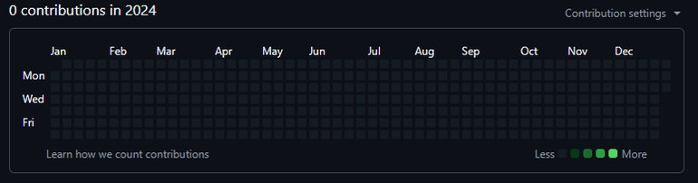

<div align="center">

# 🟩 commit-bot

**Paint your GitHub contribution graph green.**

A cross-platform CLI tool for generating backdated Git commits — fill specific dates, draw patterns, write text, or scatter random activity across your contribution graph.

[](https://nodejs.org/)
[](LICENSE)
[]()

</div>

---

##  Demo



> *Write text, draw shapes, fill years, scatter random commits — all from your terminal.*

---

##  Installation

```bash
# Install directly from GitHub (recommended)
npm install -g github:go3-14/commit_bot
```

<details>
<summary><b>Alternative: Clone & build manually</b></summary>

```bash
git clone https://github.com/go3-14/commit_bot.git
cd commit_bot
npm install
npm run build
npm link
```

</details>

> **Requirements:** [Node.js 16+](https://nodejs.org/) and [Git](https://git-scm.com/) installed on your system.

---

##  Quick Start

```bash
# 1. Create a new repo and make 5 commits on a specific date
commit-bot date -d 2024-03-15 -n 5 --init

# 2. Preview without making changes (always do this first!)
commit-bot date -d 2024-03-15 -n 5 --dry-run

# 3. Push to remote automatically
commit-bot date -d 2024-03-15 -n 5 --push
```

---

##  Commands

> 💡 For a complete reference of all flags, syntax, and advanced permutations, check out [**`COMMANDS.md`**](COMMANDS.md).

### `date` — Single Date

Create commits on a specific calendar date.

```bash
commit-bot date -d 2024-03-15 -n 5
commit-bot date --date 2024-12-25 --commits 10
```

### `grid` — By (week, day) Coordinate

Target a specific cell on the GitHub contribution graph.
- **Week:** `0` = leftmost (oldest), `52` = rightmost (current)
- **Day:** `0` = Sunday, `1` = Monday, ..., `6` = Saturday

```bash
commit-bot grid -w 10 -d 3 -n 4
commit-bot grid --week 25 --day 0 --commits 8
```

### `range` — Date Range

Fill a continuous date range with commits. Supports variable commits per day.

```bash
commit-bot range -f 2024-01-01 -t 2024-06-30
commit-bot range --from 2024-01-01 --to 2024-12-31 --min 1 --max 5
commit-bot range -f 2024-01-01 -t 2024-06-30 --weekdays-only
```

### `random` — Random Scatter

Distribute N commits randomly across a time window.

```bash
commit-bot random -n 200 --days 365
commit-bot random --total 100 --days 90 --weekdays-only
```

### `pattern` — Draw on the Graph ⭐

Write text or draw shapes directly on the contribution graph. This is the fun one.

```bash
# Write text
commit-bot pattern --text "HI" --year 2024
commit-bot pattern --text "2024" --year 2024 --intensity high

# Draw shapes
commit-bot pattern --shape heart --year 2024
commit-bot pattern --shape star --year 2024 --intensity max
```

**Available shapes:** `heart` · `smiley` · `check` · `star` · `skull` · `wave` · `diamond`

| Intensity | Commits per cell |
|-----------|:----------------:|
| `low`     | 1                |
| `medium`  | 3 *(default)*    |
| `high`    | 5                |
| `max`     | 10               |

### `fill` — Fill Entire Year

Blanket an entire year with commits for a solid green wall.

```bash
commit-bot fill --year 2024
commit-bot fill --year 2023 --min 1 --max 8
commit-bot fill --year 2024 --weekdays-only
```

### `wipe` — Reset

Remove all bot-generated commits and start fresh. Requires `--confirm` as a safety guard.

```bash
commit-bot wipe --confirm
commit-bot wipe --confirm --push
```

---

##  Global Options

These flags work with **all** commands:

| Flag | Description | Default |
|---|---|---|
| `--repo <path>` | Path to the target git repo | `.` |
| `--author <name>` | Override commit author name | git config |
| `--email <email>` | Override commit author email | git config |
| `-m, --message <msg>` | Custom commit message | `chore: update` |
| `--push` | Auto-push to remote after committing | `false` |
| `--branch <name>` | Target branch | `main` |
| `--dry-run` | Preview without making commits | `false` |
| `--init` | Initialize a git repo if one doesn't exist | `false` |
| `--verbose` | Show detailed output | `false` |

---

##  How It Works

Git allows setting custom dates for commits via `GIT_AUTHOR_DATE` and `GIT_COMMITTER_DATE` environment variables. commit-bot automates the process:

1. Modifies a file (`contributions.md`)
2. Stages the change
3. Creates a commit with a backdated timestamp
4. Optionally pushes to a remote

GitHub counts these commits toward your contribution graph as long as:

-  The commit email matches your **verified GitHub email**
-  The repository is **not a fork**
-  The commits are on the **default branch**

---

## 💡 Tips

| Tip | Why |
|---|---|
| Always use `--dry-run` first | Preview exactly what will happen before making any commits |
| Use a dedicated private repo | Keep your graph-painting separate from real projects |
| Use `--init` | Auto-creates a new git repo so you don't have to |
| Use `--push` | Saves you the manual push step |
| Randomized commit times | Times are randomized between 8 AM–10 PM for realistic-looking activity |

---

##  License

MIT — do whatever you want with it.
